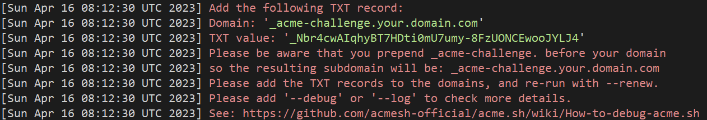
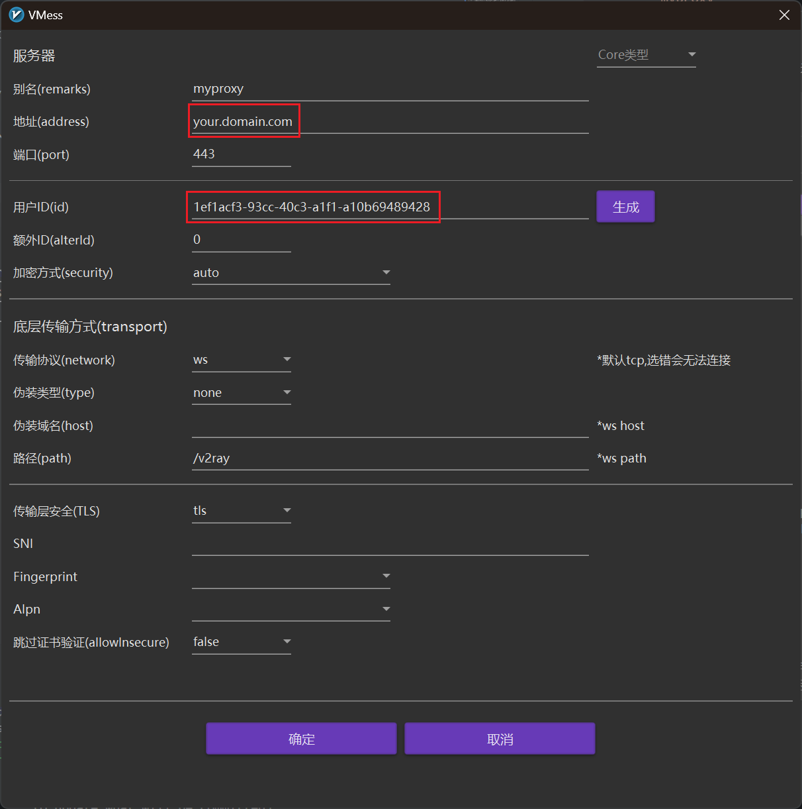

# V2Fly Docker 使用说明

> 本项目 Fork 自 [wubaiqing/v2ray-docker-compose](https://github.com/wubaiqing/v2ray-docker-compose)，将其中应用的 [v2ray](https://hub.docker.com/r/v2ray/official/) 改为最新的 [v2fly](https://hub.docker.com/r/v2fly/v2fly-core)，使得可以支持树莓派等 arm 设备。

## 准备工作

1. 安装 docker 和 docker-compose，并启动 docker 服务。由于网络上教程很多，这里不再赘述，可以参考以下教程：[安装 Docker](https://yeasy.gitbook.io/docker_practice/install)，[安装 Docker Compose](https://yeasy.gitbook.io/docker_practice/compose/install)。

1. 克隆本项目：
    ```bash
    git clone https://github.com/chuanjin-su/v2ray-docker-compose.git
    ```

1. 准备一个域名，然后把 A 记录解析改为你服务器的 ip；如果有 ipv6 需求，添加 AAAA 记录解析到 ipv6 地址。

## 服务端配置

1. 使用 [GGUID](https://www.guidgen.com/) （或其它任何工具）生成一个 UUID，然后打开 `./v2ray/config.json` 文件，修改[第 14 行](./v2ray/config.json#L14)的 ID 标识；

1. 对域名申请认证，并将证书 `cert.pem` 和密钥 `key.pem` 放置在 `./nginx/certs/` 下面。如果你没有进行过这样的认证，推荐使用 [`acme.sh`](https://github.com/Neilpang/acme.sh/wiki/%E8%AF%B4%E6%98%8E) 进行这一操作。简要步骤如下：

    1. 安装 `acme.sh`，一行命令即可。这一操作会将 `acme.sh` 安装在 `~/.acme.sh` 下面，同时自动创建一个 cronjob, 每天 0:00 点检测所有的证书, 如果快过期了, 需要更新, 则会自动更新证书。注意将以下命令的邮件改为你的邮件地址。
        ```bash
        curl https://get.acme.sh | sh -s email=my@example.com
        ```

    1. 申请证书。推荐使用手动 DNS 方式，执行命令，注意改为自己的域名：
        ```bash
        acme.sh --issue --dns -d your.domain.com \
             --yes-I-know-dns-manual-mode-enough-go-ahead-please
        ```
        这时，会返回类似如下的输出：
        
        添加域名解析的TXT记录，解析到 `_acme-challenge.your.domain.com`，内容为如上显示的 `TXT value` 后面的一长串。

    1. 获得证书和密钥。以上操作后，再在命令行输入：
        ```bash
        acme.sh --renew -d your.domain.com \
             --yes-I-know-dns-manual-mode-enough-go-ahead-please
        ```
        注意这时的选项是 `--renew`。一通操作后，如果顺利的话，`acme.sh` 会将你的证书和密钥存放在本地 `~/.acme.sh/your.domain.com/`之中。

1. 接着把证书安装到 `./nginx/certs/` 目录下：
    ```bash
    acme.sh --install-cert -d you.domain.com \
    --cert-file      ./nginx/certs/cert.pem  \
    --key-file       ./nginx/certs/key.pem
    ```

1. 修改 `./nginx/conf.d/v2ray.conf` [第 8 行](./nginx/conf.d/v2ray.conf#L8) 的域名地址。

1. [可选] 如果在一些特定的情况下更换端口（比如连接国内服务商的服务器，443可能会受限；或是在学校自己的服务器或主机搭建代理，常用端口可能会被限制），需要更改 `docker-compose.yml` [第22行](./docker-compose.yml#L22)，改为 `your_port:443`，同时按需可以注释掉第21行，同时注意在以下客户端配置中，对应将我这里给出的 443 修改为你的端口。

1. 启动临时服务测试连接：`docker-compose up`，如果测试没问题，`ctrl+c` 停止服务，再开启一个后台运行的服务：`docker-compose up -d`

## 客户端配置

### [Clash for Windows](https://github.com/Fndroid/clash_for_windows_pkg/releases)

按照以下格式创建一个 `your_config.yml` 配置文件，注意修改其中的 `server` 为你的域名，`uuid` 为上述第1步创建的 ID 标识。
```yml
port: 7890
socks-port: 7891
redir-port: 7892
mixed-port: 7893
mode: rule
log-level: silent
allow-lan: true
external-controller: 0.0.0.0:9090
bind-address: "*"
ipv6: true

proxies:
  - {
        name: myproxy,
        server: your.domain.com,
        port: 443,
        type: vmess,
        uuid: your_uuid,
        sni: ,
        alterId: 0,
        cipher: auto,
        tls: 1,
        skip-cert-verify: true,
        udp: true,
        network: ws,
        ws-opts: {
            path: /v2ray
        }
    }

proxy-groups:
  - name: proxy
    type: select
    proxies:
      - myproxy

rules:
 - MATCH,proxy
```
在 clash 中导入这一配置，启用后测试连接即可。如果需要更复杂的 clash 配置，可以参考[官方文档](https://github.com/Dreamacro/clash/wiki/configuration)。

### [V2RayN](https://github.com/2dust/v2rayN/releases)

按照下图配置即可，注意修改地址和用户，分别改为你的域名与上文提到的 UUID。配置完毕后测试连接即可。



## 资源

GGUID 生成器：https://www.guidgen.com/   
acme.sh：https://github.com/Neilpang/acme.sh/wiki/%E8%AF%B4%E6%98%8E